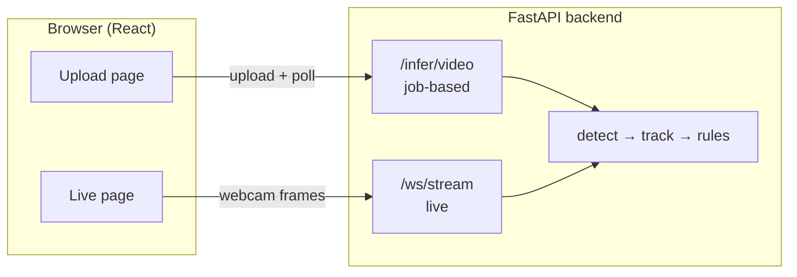
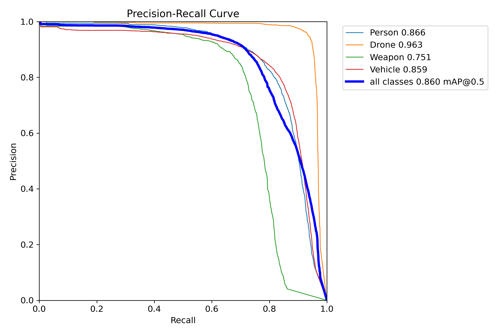
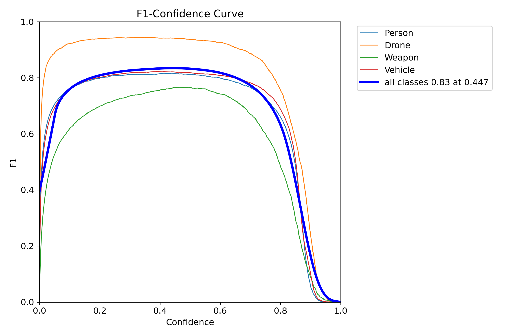
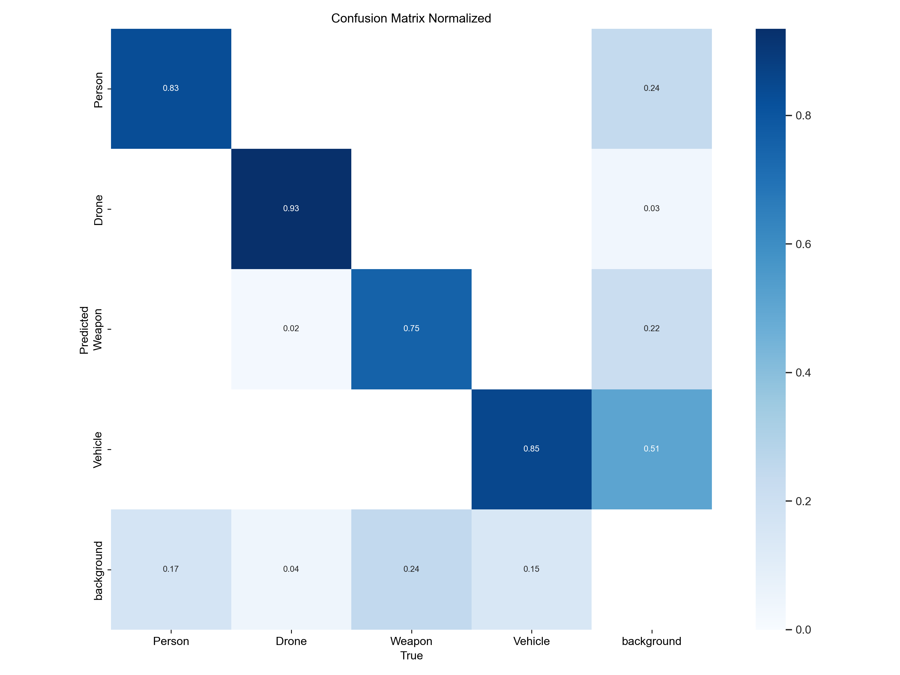

# Sensitive-Area Intrusion Detection System

[](https://github.com/raghavpli515/Sensitive-area-Intrusion-detection-system/actions/workflows/ci.yml)
[](LICENSE)
[](https://huggingface.co/spaces/PimoLee5/intrusion-detection-system)

**[Try the live demo](https://huggingface.co/spaces/PimoLee5/intrusion-detection-system)** —
upload a video, no setup required. Runs on a free Hugging Face Space
(Gradio + ZeroGPU); see [deploy/huggingface-gradio/](deploy/huggingface-gradio/)
for what that build drops versus the full app below (async job API,
live-webcam mode) and why.

A computer-vision system for detecting intrusions into restricted/sensitive
areas — perimeter fences, border zones, restricted facilities — from
surveillance footage or a live camera. It combines a fine-tuned **YOLOv8**
detector (Person / Drone / Weapon / Vehicle), **DeepSORT** multi-object
tracking, and a rule-based alerting engine (zone intrusion, perimeter-line
breach, fast movement, abandoned/dropped objects, weapon detection, group
gathering), served over a **FastAPI** backend with a **React** frontend for
both batch video upload and live webcam streaming.


*Real screen recording of this app — upload → job progress → annotated
video + alert timeline — sped up ~3x for length, nothing else altered.*

## Why this exists

Manually watching surveillance feeds for a restricted area doesn't scale.
This project automates the "notice something, flag it" step: run footage (or
a live feed) through detection + tracking, evaluate a small set of
interpretable rules on the resulting tracks, and surface alerts with the
frame and track they came from.

## Architecture



Both paths run through the exact same pipeline
(`backend/app/services/pipeline.py`) — see [docs/ARCHITECTURE.md](docs/ARCHITECTURE.md)
for the full diagram and the design decisions behind the job queue,
per-session tracking state, and configurable zone geometry.

| Layer | Tech |
|---|---|
| Detection | YOLOv8 (Ultralytics), fine-tuned, 4 classes |
| Tracking | DeepSORT (`deep-sort-realtime`) |
| Rule engine | Custom, `shapely` for zone/line geometry |
| Backend | FastAPI, async video jobs + WebSocket live stream |
| Frontend | React + TypeScript + Vite |
| Data/model versioning | DVC |
| Tests / CI | pytest, ruff, oxlint, GitHub Actions |

## Model

The shipped model (`models/yolov8_model.pt`, DVC-tracked) is a YOLOv8
checkpoint fine-tuned on a 4-class dataset built for this project:

| Class | Precision | Recall | mAP50 | mAP50-95 |
|---|---|---|---|---|
| **All classes** | 0.878 | 0.797 | 0.860 | 0.607 |

*(final epoch of the `ids_finetune_v13_safe` fine-tuning run — see
`docs/assets/` for the F1/PR curves and confusion matrix, and
`scripts/train.py` for the training entrypoint.)*

Classes: `Person`, `Drone`, `Weapon`, `Vehicle`.

<p>
  
  
  
</p>

## Getting started

### Option A — Docker Compose (fastest)

```bash
docker compose up --build
```

- Frontend: http://localhost:8080
- Backend: http://localhost:8000 (docs at `/docs`)

You'll need `models/yolov8_model.pt` present locally first (see **Model
weights** below) — the compose file mounts `./models` read-only into the
backend container.

### Option B — Local dev

**Backend**

Requires `ffmpeg` on `PATH` (used to re-encode processed video to real H.264
— see [docs/ARCHITECTURE.md](docs/ARCHITECTURE.md#known-limitations-stated-on-purpose-not-hidden)
for why). Already included in the Docker image; for local dev install it
from [ffmpeg.org](https://ffmpeg.org/download.html) or your package manager.

```bash
cd backend
python -m venv .venv && .venv\Scripts\activate   # or `source .venv/bin/activate` on macOS/Linux
pip install -r requirements.txt
uvicorn app.main:app --reload
```

Runs on http://localhost:8000. Interactive API docs at `/docs`.

**Frontend**

```bash
cd frontend
npm install
npm run dev
```

Runs on http://localhost:5173 and talks to the backend at
`http://localhost:8000` by default (override via `frontend/.env`, see
`.env.example`).

### Model weights

`models/yolov8_model.pt` is DVC-tracked, not committed to git. Either:

- `dvc pull` (requires access to the configured Google Drive remote — ask
  for access, or point `.dvc/config` at your own remote), or
- place your own YOLOv8 weights at `models/yolov8_model.pt` (or set
  `IDS_MODEL_PATH` to wherever they live).

Without a model file present, the backend still starts — `/health` will
report `model_loaded: false` and inference endpoints will fail until weights
are available. This is intentional (see `backend/tests/test_api.py`).

## Alerts read as an incident timeline, not a ping per frame

A condition that holds for 500 frames doesn't produce 500 alerts. Each rule
(zone intrusion, weapon detected, fast movement, dropped object, group
gathering) is modeled as an incident: one `started` alert the moment it
becomes true, nothing further while it's still true, and one `ended` alert
with a `duration_seconds` when it clears (or the track is lost, or
processing ends while it's still open — every `started` gets a matching
`ended`). `line_breach` is the one exception: crossing a line is a
single instantaneous event, not a sustained state.

## API

| Endpoint | Description |
|---|---|
| `GET /health/` | Liveness + whether the model is loaded |
| `POST /infer/video` | Upload a video (`file`, `confidence_threshold`) → `{job_id}` |
| `GET /infer/video/{job_id}` | Poll job status/progress/alerts |
| `GET /infer/video/{job_id}/file` | Download the annotated result once `status == "done"` |
| `WS /ws/stream` | Send JPEG frames, receive `{image_b64, detections, alerts}` per frame |

Full interactive reference: http://localhost:8000/docs once the backend is
running.

## Testing

```bash
cd backend
pytest -q      # 27 tests: rule-engine + incident-lifecycle unit tests, pipeline
               # codec-failure handling, upload-size limits, API contract
               # tests — no model required
ruff check .
```

```bash
cd frontend
npm run lint
npm run build
```

CI (`.github/workflows/ci.yml`) runs all four on every push/PR.

## Repository layout

```
backend/     FastAPI service — detection, tracking, rules, video jobs, live stream
frontend/    React + TypeScript UI — upload flow and live camera flow
models/      DVC-tracked model weights
data/        DVC-tracked datasets (uploads/, ids_finetune_v1/, raw/, ...)
docs/        Architecture notes + curated result images
scripts/     Training/dataset-prep entrypoints (train.py, validate_dataset.py, ...)
```

Local-only, not tracked in git (see `.gitignore`): `experiments/` (full
training run history), `scraped_data/` (raw scraped images), `IDS_Training/`
(an earlier baseline run), `IDS_env/` (a Python virtualenv). Their relevant
outputs are summarized above and in `docs/assets/`.

## Known limitations

- The video-job store is in-memory and process-local — see
  [docs/ARCHITECTURE.md](docs/ARCHITECTURE.md#known-limitations-stated-on-purpose-not-hidden)
  for this and the other limitations (CPU live-inference speed, the
  not-yet-wired pose-based rule, single fixed model).

## License

[MIT](LICENSE)
