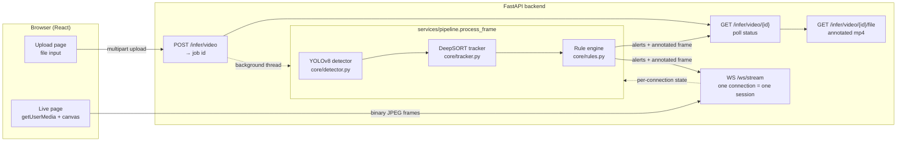

# Architecture

## Pipeline

Both entry points — batch video upload and the live camera feed — run the
exact same three-stage pipeline (`backend/app/services/pipeline.py`):
**detect → track → apply rules**. Nothing is duplicated between them; only
the I/O around the pipeline differs (a video file processed frame-by-frame on
a background thread vs. JPEG frames pushed over a WebSocket).

## Design decisions worth calling out

**One shared pipeline function, two thin transports.** The original
prototype had detect/track/annotate logic duplicated (and drifting) across
`utils/inference.py` and `backend/app/api/inference.py`. There's now exactly
one implementation (`process_frame`), used by both the job runner and the
WebSocket handler.

**Per-session tracker + rule-engine state.** `RuleEngine` and `ObjectTracker`
are instantiated once per video-processing job or per live WebSocket
connection — never shared globally. The original rule script kept track
history in module-level `defaultdict`s, so two videos processed in the same
process silently leaked state into each other. `backend/tests/test_rules.py`
has a regression test for this (`test_separate_engines_do_not_share_track_history`).

**Async job store for video uploads.** `POST /infer/video` returns a job id
immediately; a background thread does the work while the client polls
`GET /infer/video/{id}`. This is an intentionally minimal in-memory
implementation (`services/jobs.py`) — it does not survive a process restart
and won't work across multiple backend replicas. A real deployment would
swap it for Celery/RQ + Redis behind the same three-method interface
(`create`, `get`, `run_in_background`), without touching the API routes.

**Zone/line geometry scales with frame size.** The restricted-zone polygon
and perimeter line in `RuleConfig` are fractions of frame width/height, not
absolute pixels, so the same config works for a 640×360 webcam and a
3840×2160 drone clip. The original script hardcoded pixel coordinates tuned
for one specific resolution.

## Known limitations (stated on purpose, not hidden)

- **In-memory job store**: restarting the backend loses in-flight/completed
  job records (the annotated video files on disk are untouched, just the
  index to them). Fine for a demo/single-instance deployment; not for a
  multi-replica one.
- **CPU-only live inference is slow.** The live page throttles capture to
  ~5 fps for this reason. With a CUDA GPU (auto-detected at startup) it's
  comfortably real-time.
- **Pose-based "arms flaring" detection is not wired in.** `is_arms_flaring()`
  exists in `core/rules.py` as a tested pure function, but no pose-estimation
  model is part of this pipeline (the shipped model is a plain YOLOv8
  detector), so it would never receive real keypoints. Future work: add a
  YOLOv8-pose model alongside the detection model and feed its keypoints in.
- **Single fixed model.** There's no A/B or hot-swap mechanism — the model
  path is set once at startup via `IDS_MODEL_PATH`.
